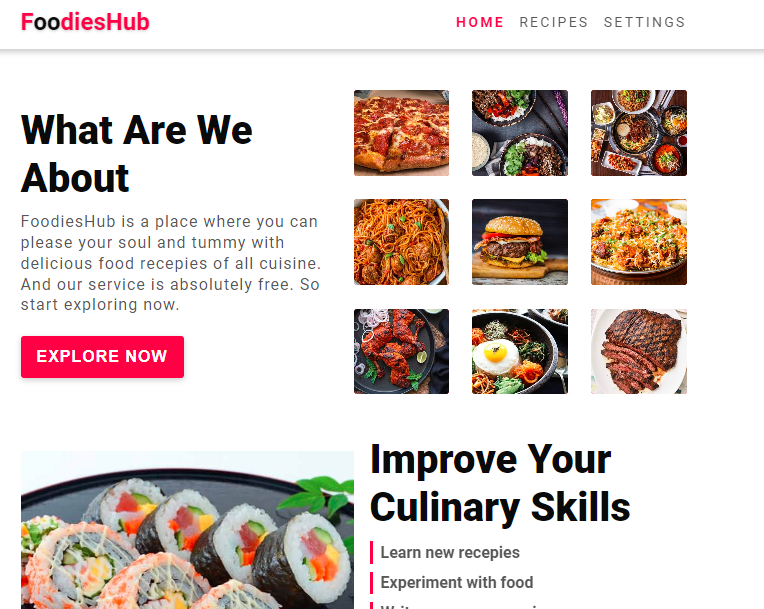
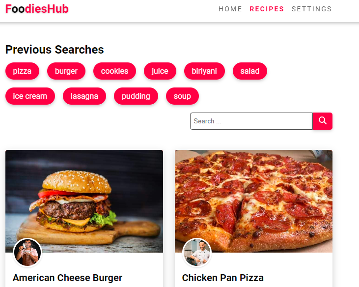

# Food Recipe Project (Frontend)
### Chingu Challenge (chingu.io)

This is a feature rich frontend (MVP) of a recipe web application built with React and styled with Sass. 

Features: 
- Users can get updates on any type of international food recipe released by other users of he platform
- Users can browse through Food recipes in categories and filter them by tags 
- Users can change the theme including the font size, font color and even animation speed of the interface.  
- User Interface is responsive on all screens

Checkout live site here : https://recipe-project-frontend.vercel.app/

